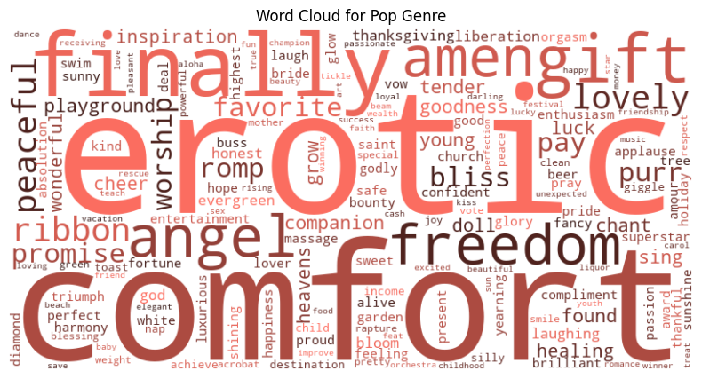
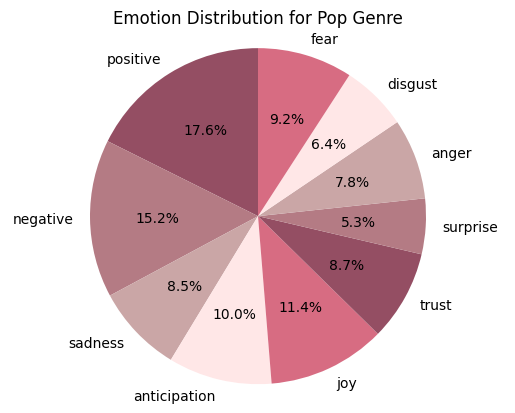

# Spotify Data Wrangling Project

## Introduction
This project explores the characteristics that define popular music on Spotify, leveraging data to analyze song attributes such as danceability, energy, and lyrical content. Our aim is to categorize song genres and understand how these features correlate with song popularity.

## Data Sources
- **Spotify Most Streamed Songs Dataset**: Available on [Kaggle](https://www.kaggle.com/datasets/abdulszz/spotify-most-streamed-songs), this dataset includes data on the most streamed songs on Spotify, detailing attributes like song name, artist, release year, and streams.
- **Spotify Web API**: Used to fetch additional metadata about tracks, including acousticness, energy, valence, and tempo.
- **Genius API**: Employed to download song lyrics for natural language processing (NLP).

## Objectives
1. **Genre Categorization Using Lyrics**: Utilize NLP techniques to analyze lyrics' sentiment based on the genre labels such as R&B, Pop, and Rap.
2. **Analysis of Musical Features**: Examine the relationship between key musical features—specifically danceability and energy—and their correlation with popularity.

## Methodology
### Data Collection
- Lyrics were retrieved using the [Genius API](https://genius.com/api-clients).
- Song metadata was obtained via the [Spotify Web API](https://developer.spotify.com/documentation/web-api).

### Data Analysis
- **Sentiment Analysis**: Performed on song lyrics to determine the emotional tone across different genres.
- **Correlation Analysis**: Explored how danceability and energy correlate with streaming counts.

## Results
Our analysis indicated that:
- Emotional resonance significantly impacts listener engagement.
- Danceability and energy, contrary to expectations, showed weak negative correlations with streaming popularity.

### Visualizations
#### Word Cloud for Pop Genre

#### Emotion Distribution for Pop Genre

#### Correlation Heatmap of Key Song Features and Streams

#### Scatter Plot of Energy vs Valence

## Conclusions
This project provided insights into the defining characteristics of popular music on Spotify. While danceability and energy were less correlated with popularity than expected, emotional content played a significant role in a song's success.

## How to Use This Repository
- Clone the repository to obtain all scripts and data files used in the analyses.
- Scripts for data collection and analysis are located in the `NLP Code` directory.

## Reference
[1] Stacy.Goldrick@groupsjr.com. (2024, April 23). Spotify Reports First Quarter 2024 Earnings. Spotify.     
https://newsroom.spotify.com/2024-04-23/spotify-reports-first-quarter-2024-earnings/

[2] Abdullah, M. (2024). Spotify Most Streamed Songs. Kaggle.com.     
https://www.kaggle.com/datasets/abdulszz/spotify-most-streamed-songs

[3] Spotify. (n.d.). Web API | Spotify for Developers. Developer.spotify.com. Retrieved October 12, 2024, from     
https://developer.spotify.com/documentation/web-api

[4] Crowdsourcing a Word-Emotion Association Lexicon, Saif Mohammad and Peter Turney, Computational Intelligence, 39(3), 555-590, 2013.

